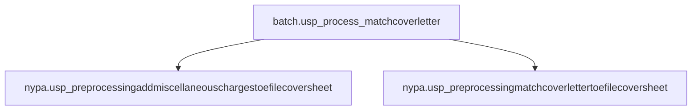

## Execution Tree — batch.usp_process_matchcoverletter

```mermaid
graph TD
    nypa_usp_preprocessingaddmiscellaneouschargestoefilecoversheet[nypa.usp_preprocessingaddmiscellaneouschargestoefilecoversheet]
    nypa_usp_preprocessingmatchcoverlettertoefilecoversheet[nypa.usp_preprocessingmatchcoverlettertoefilecoversheet]
    batch_usp_process_matchcoverletter[batch.usp_process_matchcoverletter] --> nypa_usp_preprocessingaddmiscellaneouschargestoefilecoversheet[nypa.usp_preprocessingaddmiscellaneouschargestoefilecoversheet]
    batch_usp_process_matchcoverletter[batch.usp_process_matchcoverletter] --> nypa_usp_preprocessingmatchcoverlettertoefilecoversheet[nypa.usp_preprocessingmatchcoverlettertoefilecoversheet]
```
