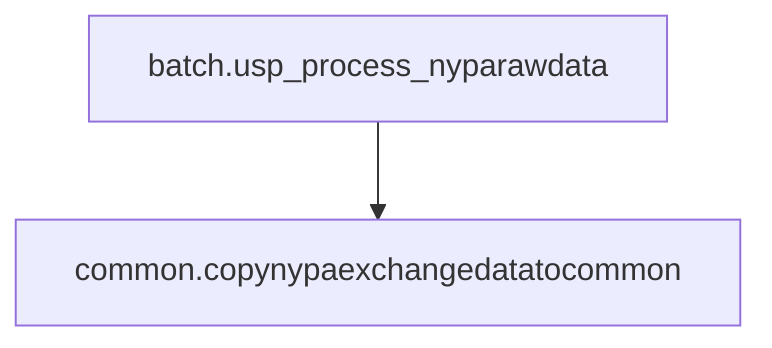

## Execution Tree — batch.usp_process_nyparawdata

```mermaid
graph TD
    common_copynypaexchangedatatocommon[common.copynypaexchangedatatocommon]
    batch_usp_process_nyparawdata[batch.usp_process_nyparawdata] --> common_copynypaexchangedatatocommon[common.copynypaexchangedatatocommon]
```
