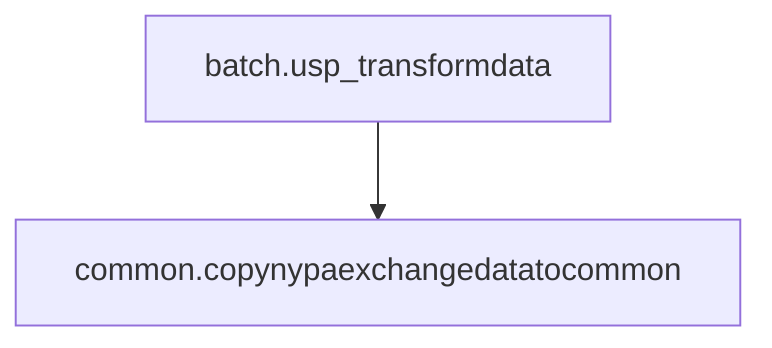

## Execution Tree — batch.usp_transformdata

```mermaid
graph TD
    common_copynypaexchangedatatocommon[common.copynypaexchangedatatocommon]
    batch_usp_transformdata[batch.usp_transformdata] --> common_copynypaexchangedatatocommon[common.copynypaexchangedatatocommon]
```
