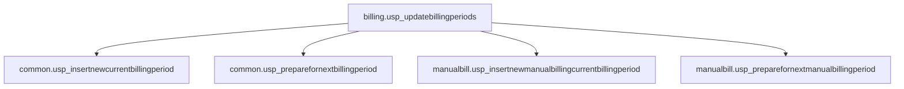

## Execution Tree — billing.usp_updatebillingperiods

```mermaid
graph TD
    common_usp_insertnewcurrentbillingperiod[common.usp_insertnewcurrentbillingperiod]
    common_usp_preparefornextbillingperiod[common.usp_preparefornextbillingperiod]
    manualbill_usp_insertnewmanualbillingcurrentbillingperiod[manualbill.usp_insertnewmanualbillingcurrentbillingperiod]
    manualbill_usp_preparefornextmanualbillingperiod[manualbill.usp_preparefornextmanualbillingperiod]
    billing_usp_updatebillingperiods[billing.usp_updatebillingperiods] --> common_usp_insertnewcurrentbillingperiod[common.usp_insertnewcurrentbillingperiod]
    billing_usp_updatebillingperiods[billing.usp_updatebillingperiods] --> common_usp_preparefornextbillingperiod[common.usp_preparefornextbillingperiod]
    billing_usp_updatebillingperiods[billing.usp_updatebillingperiods] --> manualbill_usp_insertnewmanualbillingcurrentbillingperiod[manualbill.usp_insertnewmanualbillingcurrentbillingperiod]
    billing_usp_updatebillingperiods[billing.usp_updatebillingperiods] --> manualbill_usp_preparefornextmanualbillingperiod[manualbill.usp_preparefornextmanualbillingperiod]
```
