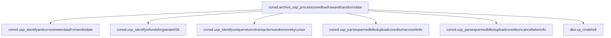

## Execution Tree — coned.archive_usp_processconedloadrawandtransformdata

```mermaid
graph TD
    coned_usp_identifyandcorrectmeterdatafromandtodate[coned.usp_identifyandcorrectmeterdatafromandtodate]
    coned_usp_identifyrefundsforgasrate036[coned.usp_identifyrefundsforgasrate036]
    coned_usp_identifyuniquenetzerotransactionsandremovebycursor[coned.usp_identifyuniquenetzerotransactionsandremovebycursor]
    coned_usp_parsespannedbilleduploadconedisonaccountinfo[coned.usp_parsespannedbilleduploadconedisonaccountinfo]
    coned_usp_parsespannedbilleduploadconedisoncancellationinfo[coned.usp_parsespannedbilleduploadconedisoncancellationinfo]
    dbo_xp_cmdshell[dbo.xp_cmdshell]
    coned_archive_usp_processconedloadrawandtransformdata[coned.archive_usp_processconedloadrawandtransformdata] --> coned_usp_identifyandcorrectmeterdatafromandtodate[coned.usp_identifyandcorrectmeterdatafromandtodate]
    coned_archive_usp_processconedloadrawandtransformdata[coned.archive_usp_processconedloadrawandtransformdata] --> coned_usp_identifyrefundsforgasrate036[coned.usp_identifyrefundsforgasrate036]
    coned_archive_usp_processconedloadrawandtransformdata[coned.archive_usp_processconedloadrawandtransformdata] --> coned_usp_identifyuniquenetzerotransactionsandremovebycursor[coned.usp_identifyuniquenetzerotransactionsandremovebycursor]
    coned_archive_usp_processconedloadrawandtransformdata[coned.archive_usp_processconedloadrawandtransformdata] --> coned_usp_parsespannedbilleduploadconedisonaccountinfo[coned.usp_parsespannedbilleduploadconedisonaccountinfo]
    coned_archive_usp_processconedloadrawandtransformdata[coned.archive_usp_processconedloadrawandtransformdata] --> coned_usp_parsespannedbilleduploadconedisoncancellationinfo[coned.usp_parsespannedbilleduploadconedisoncancellationinfo]
    coned_archive_usp_processconedloadrawandtransformdata[coned.archive_usp_processconedloadrawandtransformdata] --> dbo_xp_cmdshell[dbo.xp_cmdshell]
```
