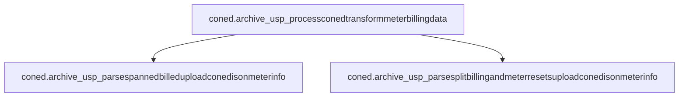

## Execution Tree — coned.archive_usp_processconedtransformmeterbillingdata

```mermaid
graph TD
    coned_archive_usp_parsespannedbilleduploadconedisonmeterinfo[coned.archive_usp_parsespannedbilleduploadconedisonmeterinfo]
    coned_archive_usp_parsesplitbillingandmeterresetsuploadconedisonmeterinfo[coned.archive_usp_parsesplitbillingandmeterresetsuploadconedisonmeterinfo]
    coned_archive_usp_processconedtransformmeterbillingdata[coned.archive_usp_processconedtransformmeterbillingdata] --> coned_archive_usp_parsespannedbilleduploadconedisonmeterinfo[coned.archive_usp_parsespannedbilleduploadconedisonmeterinfo]
    coned_archive_usp_processconedtransformmeterbillingdata[coned.archive_usp_processconedtransformmeterbillingdata] --> coned_archive_usp_parsesplitbillingandmeterresetsuploadconedisonmeterinfo[coned.archive_usp_parsesplitbillingandmeterresetsuploadconedisonmeterinfo]
```
