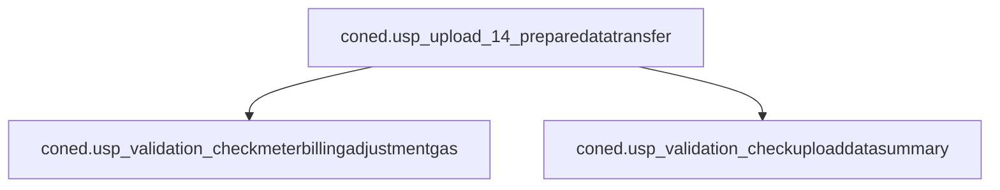

## Execution Tree — coned.usp_upload_14_preparedatatransfer

```mermaid
graph TD
    coned_usp_validation_checkmeterbillingadjustmentgas[coned.usp_validation_checkmeterbillingadjustmentgas]
    coned_usp_validation_checkuploaddatasummary[coned.usp_validation_checkuploaddatasummary]
    coned_usp_upload_14_preparedatatransfer[coned.usp_upload_14_preparedatatransfer] --> coned_usp_validation_checkmeterbillingadjustmentgas[coned.usp_validation_checkmeterbillingadjustmentgas]
    coned_usp_upload_14_preparedatatransfer[coned.usp_upload_14_preparedatatransfer] --> coned_usp_validation_checkuploaddatasummary[coned.usp_validation_checkuploaddatasummary]
```
