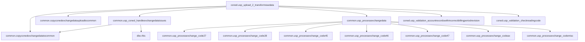

## Execution Tree — coned.usp_upload_2_transformrawdata

```mermaid
graph TD
    common_copyconedexchangedatatocommon[common.copyconedexchangedatatocommon]
    common_copyconedexchangedatauploadtocommon[common.copyconedexchangedatauploadtocommon]
    common_usp_processexchange_code27[common.usp_processexchange_code27]
    common_usp_processexchange_code28[common.usp_processexchange_code28]
    common_usp_processexchange_code45[common.usp_processexchange_code45]
    common_usp_processexchange_code46[common.usp_processexchange_code46]
    common_usp_processexchange_code47[common.usp_processexchange_code47]
    common_usp_processexchange_codeax[common.usp_processexchange_codeax]
    common_usp_processexchange_codemisc[common.usp_processexchange_codemisc]
    coned_usp_validation_accountrecordswithincorrectbillingperiodrevision[coned.usp_validation_accountrecordswithincorrectbillingperiodrevision]
    coned_usp_validation_checkreadingcode[coned.usp_validation_checkreadingcode]
    dbo_this[dbo.this]
    common_usp_coned_handleexchangedataissues[common.usp_coned_handleexchangedataissues] --> common_copyconedexchangedatatocommon[common.copyconedexchangedatatocommon]
    common_usp_coned_handleexchangedataissues[common.usp_coned_handleexchangedataissues] --> dbo_this[dbo.this]
    common_usp_processexchangedata[common.usp_processexchangedata] --> common_usp_processexchange_code27[common.usp_processexchange_code27]
    common_usp_processexchangedata[common.usp_processexchangedata] --> common_usp_processexchange_code28[common.usp_processexchange_code28]
    common_usp_processexchangedata[common.usp_processexchangedata] --> common_usp_processexchange_code45[common.usp_processexchange_code45]
    common_usp_processexchangedata[common.usp_processexchangedata] --> common_usp_processexchange_code46[common.usp_processexchange_code46]
    common_usp_processexchangedata[common.usp_processexchangedata] --> common_usp_processexchange_code47[common.usp_processexchange_code47]
    common_usp_processexchangedata[common.usp_processexchangedata] --> common_usp_processexchange_codeax[common.usp_processexchange_codeax]
    common_usp_processexchangedata[common.usp_processexchangedata] --> common_usp_processexchange_codemisc[common.usp_processexchange_codemisc]
    coned_usp_upload_2_transformrawdata[coned.usp_upload_2_transformrawdata] --> common_copyconedexchangedatatocommon[common.copyconedexchangedatatocommon]
    coned_usp_upload_2_transformrawdata[coned.usp_upload_2_transformrawdata] --> common_copyconedexchangedatauploadtocommon[common.copyconedexchangedatauploadtocommon]
    coned_usp_upload_2_transformrawdata[coned.usp_upload_2_transformrawdata] --> common_usp_coned_handleexchangedataissues[common.usp_coned_handleexchangedataissues]
    coned_usp_upload_2_transformrawdata[coned.usp_upload_2_transformrawdata] --> common_usp_processexchangedata[common.usp_processexchangedata]
    coned_usp_upload_2_transformrawdata[coned.usp_upload_2_transformrawdata] --> coned_usp_validation_accountrecordswithincorrectbillingperiodrevision[coned.usp_validation_accountrecordswithincorrectbillingperiodrevision]
    coned_usp_upload_2_transformrawdata[coned.usp_upload_2_transformrawdata] --> coned_usp_validation_checkreadingcode[coned.usp_validation_checkreadingcode]
```
