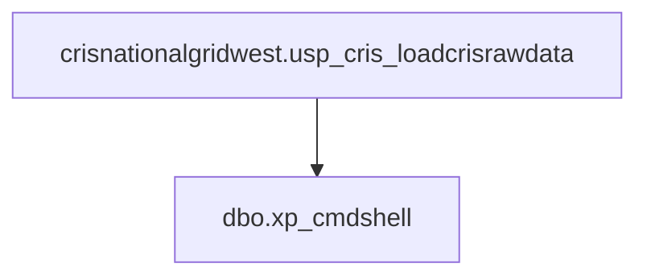

## Execution Tree — crisnationalgridwest.usp_cris_loadcrisrawdata

```mermaid
graph TD
    dbo_xp_cmdshell[dbo.xp_cmdshell]
    crisnationalgridwest_usp_cris_loadcrisrawdata[crisnationalgridwest.usp_cris_loadcrisrawdata] --> dbo_xp_cmdshell[dbo.xp_cmdshell]
```
