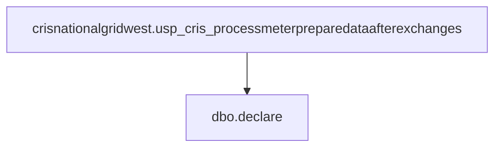

## Execution Tree — crisnationalgridwest.usp_cris_processmeterpreparedataafterexchanges

```mermaid
graph TD
    dbo_declare[dbo.declare]
    crisnationalgridwest_usp_cris_processmeterpreparedataafterexchanges[crisnationalgridwest.usp_cris_processmeterpreparedataafterexchanges] --> dbo_declare[dbo.declare]
```
