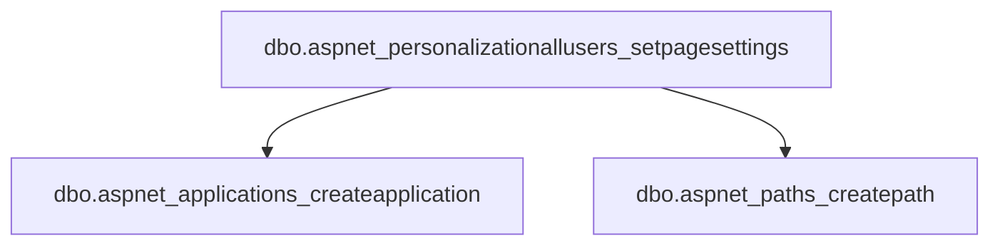

## Execution Tree — dbo.aspnet_personalizationallusers_setpagesettings

```mermaid
graph TD
    dbo_aspnet_applications_createapplication[dbo.aspnet_applications_createapplication]
    dbo_aspnet_paths_createpath[dbo.aspnet_paths_createpath]
    dbo_aspnet_personalizationallusers_setpagesettings[dbo.aspnet_personalizationallusers_setpagesettings] --> dbo_aspnet_applications_createapplication[dbo.aspnet_applications_createapplication]
    dbo_aspnet_personalizationallusers_setpagesettings[dbo.aspnet_personalizationallusers_setpagesettings] --> dbo_aspnet_paths_createpath[dbo.aspnet_paths_createpath]
```
