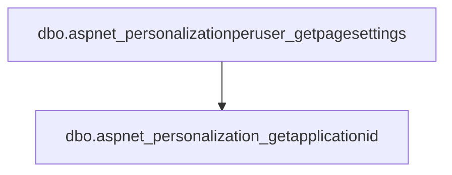

## Execution Tree — dbo.aspnet_personalizationperuser_getpagesettings

```mermaid
graph TD
    dbo_aspnet_personalization_getapplicationid[dbo.aspnet_personalization_getapplicationid]
    dbo_aspnet_personalizationperuser_getpagesettings[dbo.aspnet_personalizationperuser_getpagesettings] --> dbo_aspnet_personalization_getapplicationid[dbo.aspnet_personalization_getapplicationid]
```
