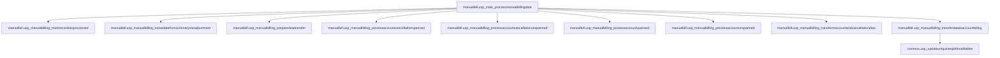

## Execution Tree — manualbill.usp_main_processmanualbillingdata

```mermaid
graph TD
    common_usp_updateuniqueseqidsforalltables[common.usp_updateuniqueseqidsforalltables]
    manualbill_usp_manualbilling_markrecordsasprocessed[manualbill.usp_manualbilling_markrecordsasprocessed]
    manualbill_usp_manualbilling_movedatafromsummaryintoadjustment[manualbill.usp_manualbilling_movedatafromsummaryintoadjustment]
    manualbill_usp_manualbilling_preparedatatransfer[manualbill.usp_manualbilling_preparedatatransfer]
    manualbill_usp_manualbilling_processaccountcancellationspanned[manualbill.usp_manualbilling_processaccountcancellationspanned]
    manualbill_usp_manualbilling_processaccountcancellationunspanned[manualbill.usp_manualbilling_processaccountcancellationunspanned]
    manualbill_usp_manualbilling_processaccountspanned[manualbill.usp_manualbilling_processaccountspanned]
    manualbill_usp_manualbilling_processaccountunspanned[manualbill.usp_manualbilling_processaccountunspanned]
    manualbill_usp_manualbilling_transformaccountandcancellationdata[manualbill.usp_manualbilling_transformaccountandcancellationdata]
    manualbill_usp_main_processmanualbillingdata[manualbill.usp_main_processmanualbillingdata] --> manualbill_usp_manualbilling_markrecordsasprocessed[manualbill.usp_manualbilling_markrecordsasprocessed]
    manualbill_usp_main_processmanualbillingdata[manualbill.usp_main_processmanualbillingdata] --> manualbill_usp_manualbilling_movedatafromsummaryintoadjustment[manualbill.usp_manualbilling_movedatafromsummaryintoadjustment]
    manualbill_usp_main_processmanualbillingdata[manualbill.usp_main_processmanualbillingdata] --> manualbill_usp_manualbilling_preparedatatransfer[manualbill.usp_manualbilling_preparedatatransfer]
    manualbill_usp_main_processmanualbillingdata[manualbill.usp_main_processmanualbillingdata] --> manualbill_usp_manualbilling_processaccountcancellationspanned[manualbill.usp_manualbilling_processaccountcancellationspanned]
    manualbill_usp_main_processmanualbillingdata[manualbill.usp_main_processmanualbillingdata] --> manualbill_usp_manualbilling_processaccountcancellationunspanned[manualbill.usp_manualbilling_processaccountcancellationunspanned]
    manualbill_usp_main_processmanualbillingdata[manualbill.usp_main_processmanualbillingdata] --> manualbill_usp_manualbilling_processaccountspanned[manualbill.usp_manualbilling_processaccountspanned]
    manualbill_usp_main_processmanualbillingdata[manualbill.usp_main_processmanualbillingdata] --> manualbill_usp_manualbilling_processaccountunspanned[manualbill.usp_manualbilling_processaccountunspanned]
    manualbill_usp_main_processmanualbillingdata[manualbill.usp_main_processmanualbillingdata] --> manualbill_usp_manualbilling_transferdatatoaccountbilling[manualbill.usp_manualbilling_transferdatatoaccountbilling]
    manualbill_usp_main_processmanualbillingdata[manualbill.usp_main_processmanualbillingdata] --> manualbill_usp_manualbilling_transformaccountandcancellationdata[manualbill.usp_manualbilling_transformaccountandcancellationdata]
    manualbill_usp_manualbilling_transferdatatoaccountbilling[manualbill.usp_manualbilling_transferdatatoaccountbilling] --> common_usp_updateuniqueseqidsforalltables[common.usp_updateuniqueseqidsforalltables]
```
