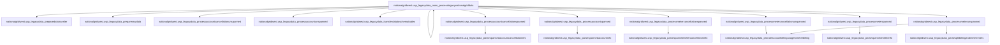

## Execution Tree — nationalgridwest.usp_legacydata_main_processlegacynationalgriddata

```mermaid
graph TD
    nationalgridwest_usp_legacydata_parsespannedaccountcancellationinfo[nationalgridwest.usp_legacydata_parsespannedaccountcancellationinfo]
    nationalgridwest_usp_legacydata_parsespannedaccountinfo[nationalgridwest.usp_legacydata_parsespannedaccountinfo]
    nationalgridwest_usp_legacydata_parsespannedmetercancellationinfo[nationalgridwest.usp_legacydata_parsespannedmetercancellationinfo]
    nationalgridwest_usp_legacydata_parsespannedmeterinfo[nationalgridwest.usp_legacydata_parsespannedmeterinfo]
    nationalgridwest_usp_legacydata_parsesplitbillingandmeterresets[nationalgridwest.usp_legacydata_parsesplitbillingandmeterresets]
    nationalgridwest_usp_legacydata_preparedatatransfer[nationalgridwest.usp_legacydata_preparedatatransfer]
    nationalgridwest_usp_legacydata_preparerawdata[nationalgridwest.usp_legacydata_preparerawdata]
    nationalgridwest_usp_legacydata_processaccountcancellationunspanned[nationalgridwest.usp_legacydata_processaccountcancellationunspanned]
    nationalgridwest_usp_legacydata_processaccountunspanned[nationalgridwest.usp_legacydata_processaccountunspanned]
    nationalgridwest_usp_legacydata_prorateaccountbillingusagetometerbilling[nationalgridwest.usp_legacydata_prorateaccountbillingusagetometerbilling]
    nationalgridwest_usp_legacydata_transferdatatoschematables[nationalgridwest.usp_legacydata_transferdatatoschematables]
    nationalgridwest_usp_legacydata_main_processlegacynationalgriddata[nationalgridwest.usp_legacydata_main_processlegacynationalgriddata] --> nationalgridwest_usp_legacydata_main_processlegacynationalgriddata[nationalgridwest.usp_legacydata_main_processlegacynationalgriddata]
    nationalgridwest_usp_legacydata_main_processlegacynationalgriddata[nationalgridwest.usp_legacydata_main_processlegacynationalgriddata] --> nationalgridwest_usp_legacydata_preparedatatransfer[nationalgridwest.usp_legacydata_preparedatatransfer]
    nationalgridwest_usp_legacydata_main_processlegacynationalgriddata[nationalgridwest.usp_legacydata_main_processlegacynationalgriddata] --> nationalgridwest_usp_legacydata_preparerawdata[nationalgridwest.usp_legacydata_preparerawdata]
    nationalgridwest_usp_legacydata_main_processlegacynationalgriddata[nationalgridwest.usp_legacydata_main_processlegacynationalgriddata] --> nationalgridwest_usp_legacydata_processaccountcancellationspanned[nationalgridwest.usp_legacydata_processaccountcancellationspanned]
    nationalgridwest_usp_legacydata_main_processlegacynationalgriddata[nationalgridwest.usp_legacydata_main_processlegacynationalgriddata] --> nationalgridwest_usp_legacydata_processaccountcancellationunspanned[nationalgridwest.usp_legacydata_processaccountcancellationunspanned]
    nationalgridwest_usp_legacydata_main_processlegacynationalgriddata[nationalgridwest.usp_legacydata_main_processlegacynationalgriddata] --> nationalgridwest_usp_legacydata_processaccountspanned[nationalgridwest.usp_legacydata_processaccountspanned]
    nationalgridwest_usp_legacydata_main_processlegacynationalgriddata[nationalgridwest.usp_legacydata_main_processlegacynationalgriddata] --> nationalgridwest_usp_legacydata_processaccountunspanned[nationalgridwest.usp_legacydata_processaccountunspanned]
    nationalgridwest_usp_legacydata_main_processlegacynationalgriddata[nationalgridwest.usp_legacydata_main_processlegacynationalgriddata] --> nationalgridwest_usp_legacydata_processmetercancellationspanned[nationalgridwest.usp_legacydata_processmetercancellationspanned]
    nationalgridwest_usp_legacydata_main_processlegacynationalgriddata[nationalgridwest.usp_legacydata_main_processlegacynationalgriddata] --> nationalgridwest_usp_legacydata_processmetercancellationunspanned[nationalgridwest.usp_legacydata_processmetercancellationunspanned]
    nationalgridwest_usp_legacydata_main_processlegacynationalgriddata[nationalgridwest.usp_legacydata_main_processlegacynationalgriddata] --> nationalgridwest_usp_legacydata_processmeterspanned[nationalgridwest.usp_legacydata_processmeterspanned]
    nationalgridwest_usp_legacydata_main_processlegacynationalgriddata[nationalgridwest.usp_legacydata_main_processlegacynationalgriddata] --> nationalgridwest_usp_legacydata_processmeterunspanned[nationalgridwest.usp_legacydata_processmeterunspanned]
    nationalgridwest_usp_legacydata_main_processlegacynationalgriddata[nationalgridwest.usp_legacydata_main_processlegacynationalgriddata] --> nationalgridwest_usp_legacydata_transferdatatoschematables[nationalgridwest.usp_legacydata_transferdatatoschematables]
    nationalgridwest_usp_legacydata_processaccountcancellationspanned[nationalgridwest.usp_legacydata_processaccountcancellationspanned] --> nationalgridwest_usp_legacydata_parsespannedaccountcancellationinfo[nationalgridwest.usp_legacydata_parsespannedaccountcancellationinfo]
    nationalgridwest_usp_legacydata_processaccountspanned[nationalgridwest.usp_legacydata_processaccountspanned] --> nationalgridwest_usp_legacydata_parsespannedaccountinfo[nationalgridwest.usp_legacydata_parsespannedaccountinfo]
    nationalgridwest_usp_legacydata_processmetercancellationspanned[nationalgridwest.usp_legacydata_processmetercancellationspanned] --> nationalgridwest_usp_legacydata_parsespannedmetercancellationinfo[nationalgridwest.usp_legacydata_parsespannedmetercancellationinfo]
    nationalgridwest_usp_legacydata_processmetercancellationunspanned[nationalgridwest.usp_legacydata_processmetercancellationunspanned] --> nationalgridwest_usp_legacydata_prorateaccountbillingusagetometerbilling[nationalgridwest.usp_legacydata_prorateaccountbillingusagetometerbilling]
    nationalgridwest_usp_legacydata_processmeterspanned[nationalgridwest.usp_legacydata_processmeterspanned] --> nationalgridwest_usp_legacydata_parsespannedmeterinfo[nationalgridwest.usp_legacydata_parsespannedmeterinfo]
    nationalgridwest_usp_legacydata_processmeterunspanned[nationalgridwest.usp_legacydata_processmeterunspanned] --> nationalgridwest_usp_legacydata_parsesplitbillingandmeterresets[nationalgridwest.usp_legacydata_parsesplitbillingandmeterresets]
    nationalgridwest_usp_legacydata_processmeterunspanned[nationalgridwest.usp_legacydata_processmeterunspanned] --> nationalgridwest_usp_legacydata_prorateaccountbillingusagetometerbilling[nationalgridwest.usp_legacydata_prorateaccountbillingusagetometerbilling]
```
