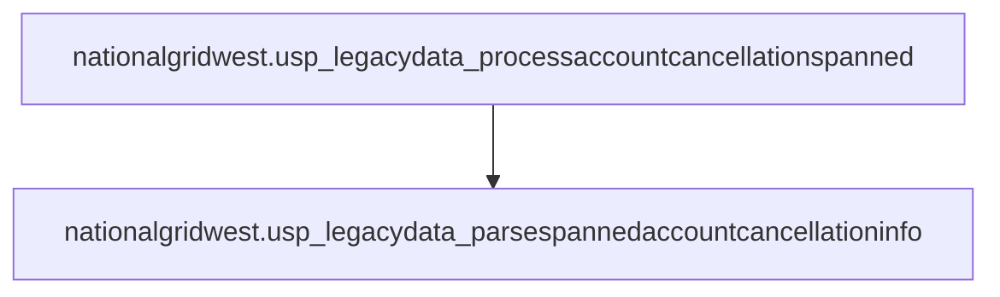

## Execution Tree — nationalgridwest.usp_legacydata_processaccountcancellationspanned

```mermaid
graph TD
    nationalgridwest_usp_legacydata_parsespannedaccountcancellationinfo[nationalgridwest.usp_legacydata_parsespannedaccountcancellationinfo]
    nationalgridwest_usp_legacydata_processaccountcancellationspanned[nationalgridwest.usp_legacydata_processaccountcancellationspanned] --> nationalgridwest_usp_legacydata_parsespannedaccountcancellationinfo[nationalgridwest.usp_legacydata_parsespannedaccountcancellationinfo]
```
