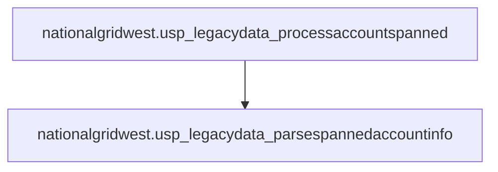

## Execution Tree — nationalgridwest.usp_legacydata_processaccountspanned

```mermaid
graph TD
    nationalgridwest_usp_legacydata_parsespannedaccountinfo[nationalgridwest.usp_legacydata_parsespannedaccountinfo]
    nationalgridwest_usp_legacydata_processaccountspanned[nationalgridwest.usp_legacydata_processaccountspanned] --> nationalgridwest_usp_legacydata_parsespannedaccountinfo[nationalgridwest.usp_legacydata_parsespannedaccountinfo]
```
