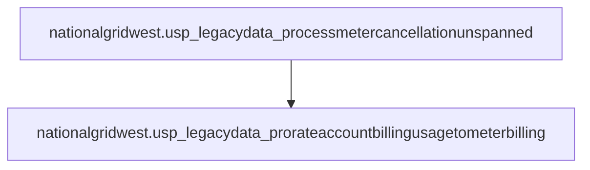

## Execution Tree — nationalgridwest.usp_legacydata_processmetercancellationunspanned

```mermaid
graph TD
    nationalgridwest_usp_legacydata_prorateaccountbillingusagetometerbilling[nationalgridwest.usp_legacydata_prorateaccountbillingusagetometerbilling]
    nationalgridwest_usp_legacydata_processmetercancellationunspanned[nationalgridwest.usp_legacydata_processmetercancellationunspanned] --> nationalgridwest_usp_legacydata_prorateaccountbillingusagetometerbilling[nationalgridwest.usp_legacydata_prorateaccountbillingusagetometerbilling]
```
