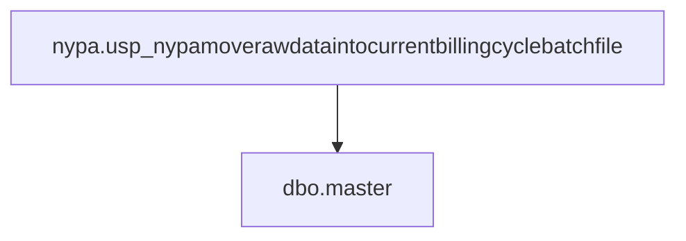

## Execution Tree — nypa.usp_nypamoverawdataintocurrentbillingcyclebatchfile

```mermaid
graph TD
    dbo_master[dbo.master]
    nypa_usp_nypamoverawdataintocurrentbillingcyclebatchfile[nypa.usp_nypamoverawdataintocurrentbillingcyclebatchfile] --> dbo_master[dbo.master]
```
