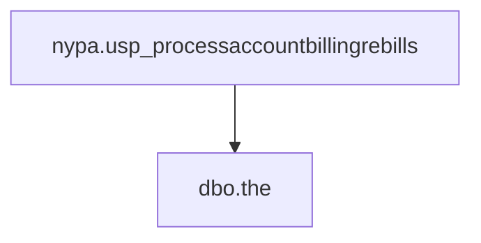

## Execution Tree — nypa.usp_processaccountbillingrebills

```mermaid
graph TD
    dbo_the[dbo.the]
    nypa_usp_processaccountbillingrebills[nypa.usp_processaccountbillingrebills] --> dbo_the[dbo.the]
```
