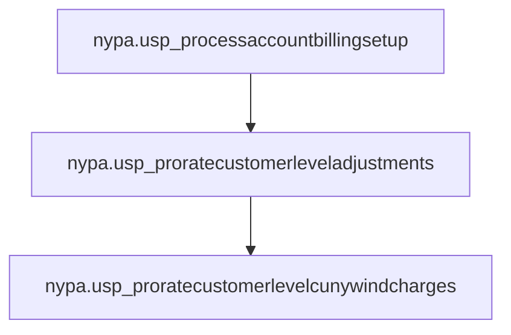

## Execution Tree — nypa.usp_processaccountbillingsetup

```mermaid
graph TD
    nypa_usp_proratecustomerlevelcunywindcharges[nypa.usp_proratecustomerlevelcunywindcharges]
    nypa_usp_processaccountbillingsetup[nypa.usp_processaccountbillingsetup] --> nypa_usp_proratecustomerleveladjustments[nypa.usp_proratecustomerleveladjustments]
    nypa_usp_proratecustomerleveladjustments[nypa.usp_proratecustomerleveladjustments] --> nypa_usp_proratecustomerlevelcunywindcharges[nypa.usp_proratecustomerlevelcunywindcharges]
```
