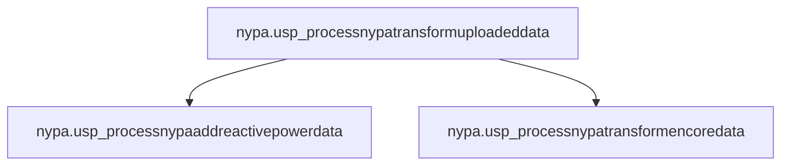

## Execution Tree — nypa.usp_processnypatransformuploadeddata

```mermaid
graph TD
    nypa_usp_processnypaaddreactivepowerdata[nypa.usp_processnypaaddreactivepowerdata]
    nypa_usp_processnypatransformencoredata[nypa.usp_processnypatransformencoredata]
    nypa_usp_processnypatransformuploadeddata[nypa.usp_processnypatransformuploadeddata] --> nypa_usp_processnypaaddreactivepowerdata[nypa.usp_processnypaaddreactivepowerdata]
    nypa_usp_processnypatransformuploadeddata[nypa.usp_processnypatransformuploadeddata] --> nypa_usp_processnypatransformencoredata[nypa.usp_processnypatransformencoredata]
```
