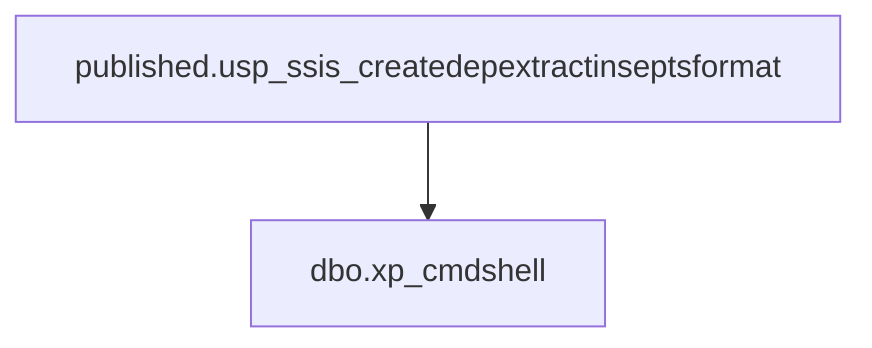

## Execution Tree — published.usp_ssis_createdepextractinseptsformat

```mermaid
graph TD
    dbo_xp_cmdshell[dbo.xp_cmdshell]
    published_usp_ssis_createdepextractinseptsformat[published.usp_ssis_createdepextractinseptsformat] --> dbo_xp_cmdshell[dbo.xp_cmdshell]
```
