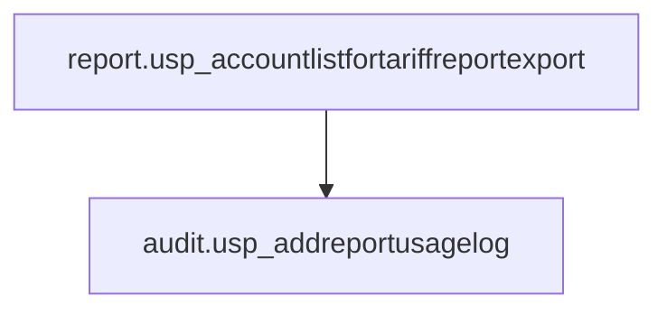

## Execution Tree — report.usp_accountlistfortariffreportexport

```mermaid
graph TD
    audit_usp_addreportusagelog[audit.usp_addreportusagelog]
    report_usp_accountlistfortariffreportexport[report.usp_accountlistfortariffreportexport] --> audit_usp_addreportusagelog[audit.usp_addreportusagelog]
```
