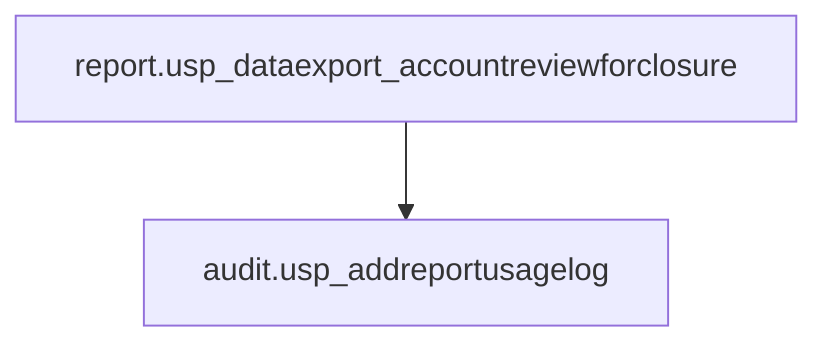

## Execution Tree — report.usp_dataexport_accountreviewforclosure

```mermaid
graph TD
    audit_usp_addreportusagelog[audit.usp_addreportusagelog]
    report_usp_dataexport_accountreviewforclosure[report.usp_dataexport_accountreviewforclosure] --> audit_usp_addreportusagelog[audit.usp_addreportusagelog]
```
