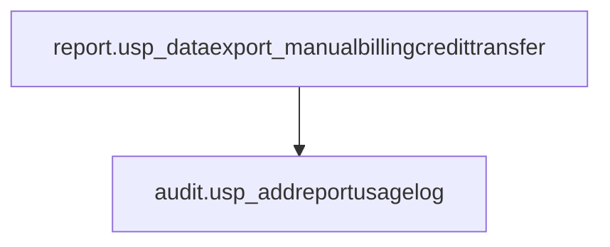

## Execution Tree — report.usp_dataexport_manualbillingcredittransfer

```mermaid
graph TD
    audit_usp_addreportusagelog[audit.usp_addreportusagelog]
    report_usp_dataexport_manualbillingcredittransfer[report.usp_dataexport_manualbillingcredittransfer] --> audit_usp_addreportusagelog[audit.usp_addreportusagelog]
```
