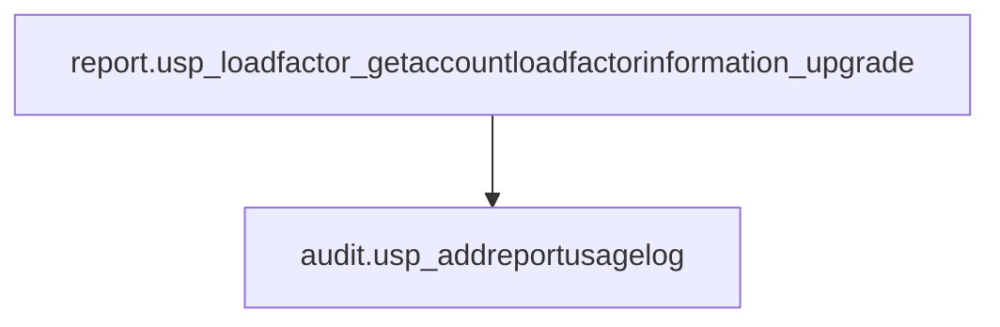

## Execution Tree — report.usp_loadfactor_getaccountloadfactorinformation_upgrade

```mermaid
graph TD
    audit_usp_addreportusagelog[audit.usp_addreportusagelog]
    report_usp_loadfactor_getaccountloadfactorinformation_upgrade[report.usp_loadfactor_getaccountloadfactorinformation_upgrade] --> audit_usp_addreportusagelog[audit.usp_addreportusagelog]
```
