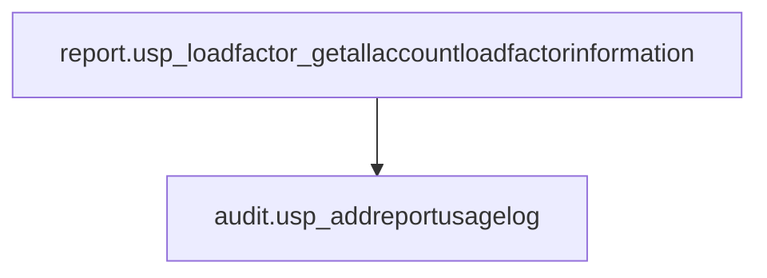

## Execution Tree — report.usp_loadfactor_getallaccountloadfactorinformation

```mermaid
graph TD
    audit_usp_addreportusagelog[audit.usp_addreportusagelog]
    report_usp_loadfactor_getallaccountloadfactorinformation[report.usp_loadfactor_getallaccountloadfactorinformation] --> audit_usp_addreportusagelog[audit.usp_addreportusagelog]
```
