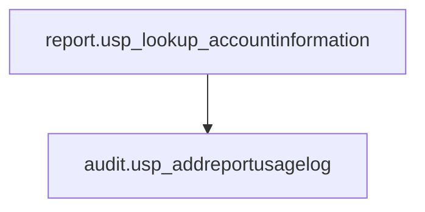

## Execution Tree — report.usp_lookup_accountinformation

```mermaid
graph TD
    audit_usp_addreportusagelog[audit.usp_addreportusagelog]
    report_usp_lookup_accountinformation[report.usp_lookup_accountinformation] --> audit_usp_addreportusagelog[audit.usp_addreportusagelog]
```
