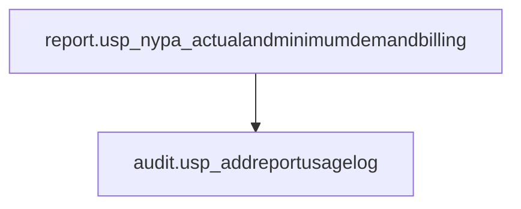

## Execution Tree — report.usp_nypa_actualandminimumdemandbilling

```mermaid
graph TD
    audit_usp_addreportusagelog[audit.usp_addreportusagelog]
    report_usp_nypa_actualandminimumdemandbilling[report.usp_nypa_actualandminimumdemandbilling] --> audit_usp_addreportusagelog[audit.usp_addreportusagelog]
```
