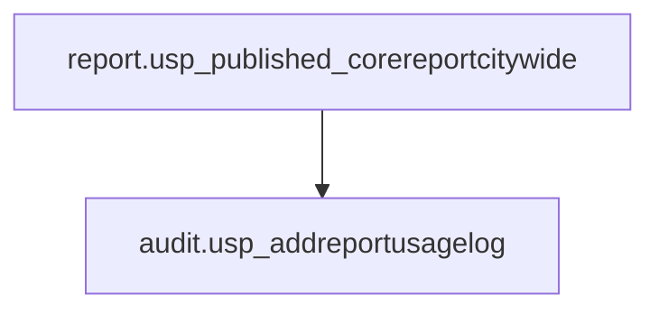

## Execution Tree — report.usp_published_corereportcitywide

```mermaid
graph TD
    audit_usp_addreportusagelog[audit.usp_addreportusagelog]
    report_usp_published_corereportcitywide[report.usp_published_corereportcitywide] --> audit_usp_addreportusagelog[audit.usp_addreportusagelog]
```
