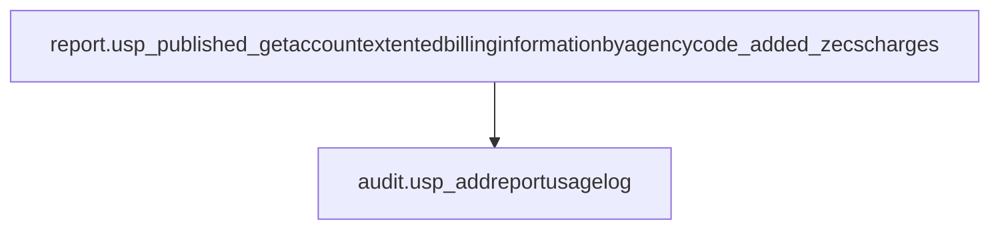

## Execution Tree — report.usp_published_getaccountextentedbillinginformationbyagencycode_added_zecscharges

```mermaid
graph TD
    audit_usp_addreportusagelog[audit.usp_addreportusagelog]
    report_usp_published_getaccountextentedbillinginformationbyagencycode_added_zecscharges[report.usp_published_getaccountextentedbillinginformationbyagencycode_added_zecscharges] --> audit_usp_addreportusagelog[audit.usp_addreportusagelog]
```
