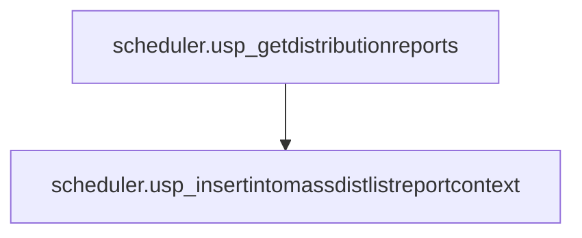

## Execution Tree — scheduler.usp_getdistributionreports

```mermaid
graph TD
    scheduler_usp_insertintomassdistlistreportcontext[scheduler.usp_insertintomassdistlistreportcontext]
    scheduler_usp_getdistributionreports[scheduler.usp_getdistributionreports] --> scheduler_usp_insertintomassdistlistreportcontext[scheduler.usp_insertintomassdistlistreportcontext]
```
