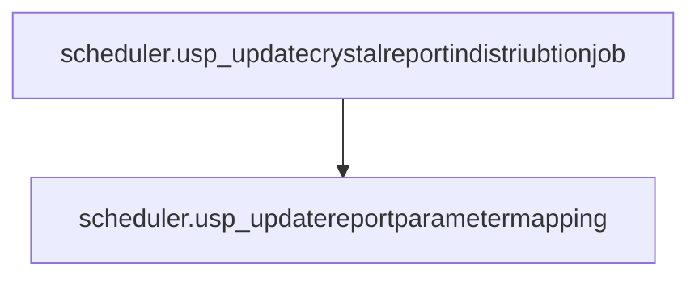

## Execution Tree — scheduler.usp_updatecrystalreportindistriubtionjob

```mermaid
graph TD
    scheduler_usp_updatereportparametermapping[scheduler.usp_updatereportparametermapping]
    scheduler_usp_updatecrystalreportindistriubtionjob[scheduler.usp_updatecrystalreportindistriubtionjob] --> scheduler_usp_updatereportparametermapping[scheduler.usp_updatereportparametermapping]
```
