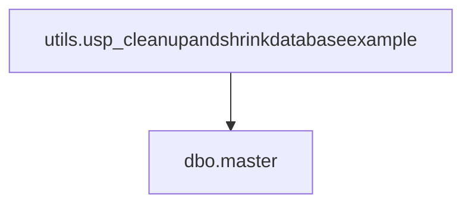

## Execution Tree — utils.usp_cleanupandshrinkdatabaseexample

```mermaid
graph TD
    dbo_master[dbo.master]
    utils_usp_cleanupandshrinkdatabaseexample[utils.usp_cleanupandshrinkdatabaseexample] --> dbo_master[dbo.master]
```
