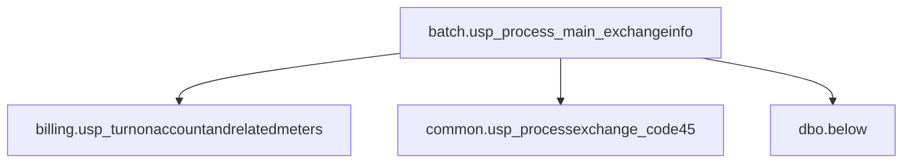

## Execution Tree — batch.usp_process_main_exchangeinfo

```mermaid
graph TD
    billing_usp_turnonaccountandrelatedmeters[billing.usp_turnonaccountandrelatedmeters]
    common_usp_processexchange_code45[common.usp_processexchange_code45]
    dbo_below[dbo.below]
    batch_usp_process_main_exchangeinfo[batch.usp_process_main_exchangeinfo] --> billing_usp_turnonaccountandrelatedmeters[billing.usp_turnonaccountandrelatedmeters]
    batch_usp_process_main_exchangeinfo[batch.usp_process_main_exchangeinfo] --> common_usp_processexchange_code45[common.usp_processexchange_code45]
    batch_usp_process_main_exchangeinfo[batch.usp_process_main_exchangeinfo] --> dbo_below[dbo.below]
```
