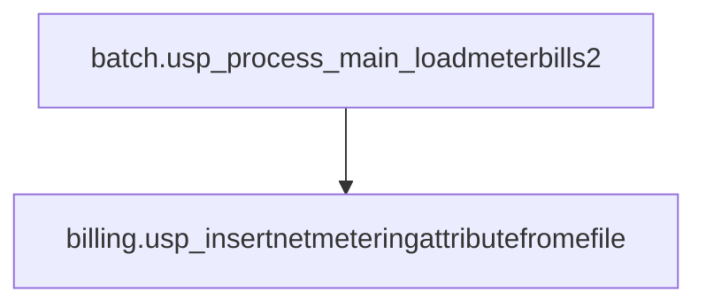

## Execution Tree — batch.usp_process_main_loadmeterbills2

```mermaid
graph TD
    billing_usp_insertnetmeteringattributefromefile[billing.usp_insertnetmeteringattributefromefile]
    batch_usp_process_main_loadmeterbills2[batch.usp_process_main_loadmeterbills2] --> billing_usp_insertnetmeteringattributefromefile[billing.usp_insertnetmeteringattributefromefile]
```
