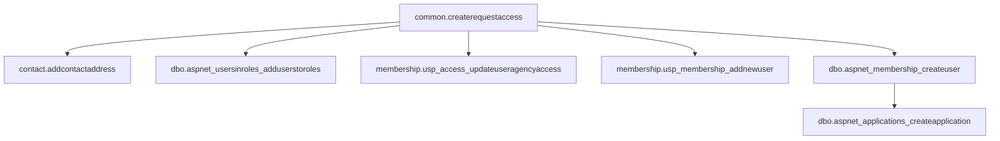

## Execution Tree — common.createrequestaccess

```mermaid
graph TD
    contact_addcontactaddress[contact.addcontactaddress]
    dbo_aspnet_applications_createapplication[dbo.aspnet_applications_createapplication]
    dbo_aspnet_usersinroles_adduserstoroles[dbo.aspnet_usersinroles_adduserstoroles]
    membership_usp_access_updateuseragencyaccess[membership.usp_access_updateuseragencyaccess]
    membership_usp_membership_addnewuser[membership.usp_membership_addnewuser]
    common_createrequestaccess[common.createrequestaccess] --> contact_addcontactaddress[contact.addcontactaddress]
    common_createrequestaccess[common.createrequestaccess] --> dbo_aspnet_membership_createuser[dbo.aspnet_membership_createuser]
    common_createrequestaccess[common.createrequestaccess] --> dbo_aspnet_usersinroles_adduserstoroles[dbo.aspnet_usersinroles_adduserstoroles]
    common_createrequestaccess[common.createrequestaccess] --> membership_usp_access_updateuseragencyaccess[membership.usp_access_updateuseragencyaccess]
    common_createrequestaccess[common.createrequestaccess] --> membership_usp_membership_addnewuser[membership.usp_membership_addnewuser]
    dbo_aspnet_membership_createuser[dbo.aspnet_membership_createuser] --> dbo_aspnet_applications_createapplication[dbo.aspnet_applications_createapplication]
```
