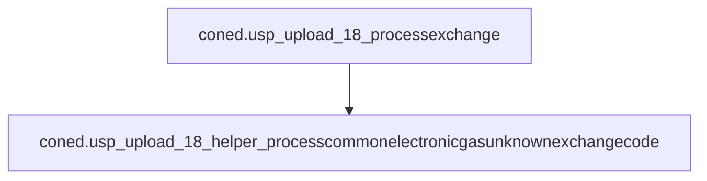

## Execution Tree — coned.usp_upload_18_processexchange

```mermaid
graph TD
    coned_usp_upload_18_helper_processcommonelectronicgasunknownexchangecode[coned.usp_upload_18_helper_processcommonelectronicgasunknownexchangecode]
    coned_usp_upload_18_processexchange[coned.usp_upload_18_processexchange] --> coned_usp_upload_18_helper_processcommonelectronicgasunknownexchangecode[coned.usp_upload_18_helper_processcommonelectronicgasunknownexchangecode]
```
