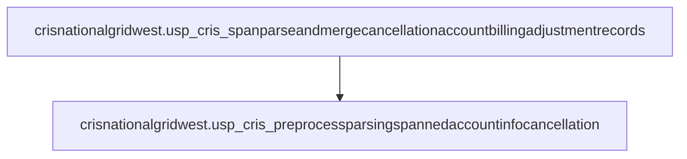

## Execution Tree — crisnationalgridwest.usp_cris_spanparseandmergecancellationaccountbillingadjustmentrecords

```mermaid
graph TD
    crisnationalgridwest_usp_cris_preprocessparsingspannedaccountinfocancellation[crisnationalgridwest.usp_cris_preprocessparsingspannedaccountinfocancellation]
    crisnationalgridwest_usp_cris_spanparseandmergecancellationaccountbillingadjustmentrecords[crisnationalgridwest.usp_cris_spanparseandmergecancellationaccountbillingadjustmentrecords] --> crisnationalgridwest_usp_cris_preprocessparsingspannedaccountinfocancellation[crisnationalgridwest.usp_cris_preprocessparsingspannedaccountinfocancellation]
```
