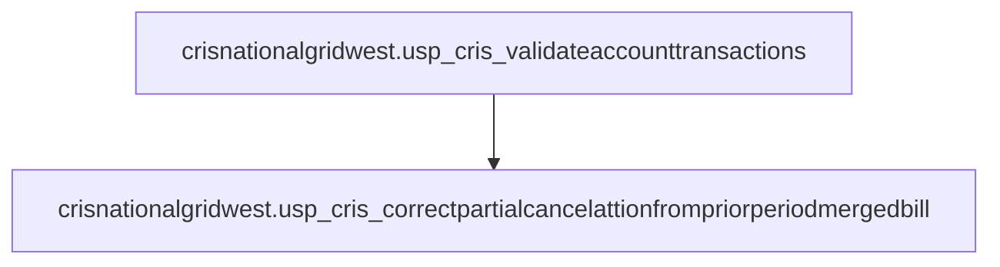

## Execution Tree — crisnationalgridwest.usp_cris_validateaccounttransactions

```mermaid
graph TD
    crisnationalgridwest_usp_cris_correctpartialcancelattionfrompriorperiodmergedbill[crisnationalgridwest.usp_cris_correctpartialcancelattionfrompriorperiodmergedbill]
    crisnationalgridwest_usp_cris_validateaccounttransactions[crisnationalgridwest.usp_cris_validateaccounttransactions] --> crisnationalgridwest_usp_cris_correctpartialcancelattionfrompriorperiodmergedbill[crisnationalgridwest.usp_cris_correctpartialcancelattionfrompriorperiodmergedbill]
```
