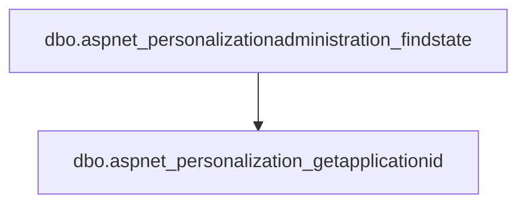

## Execution Tree — dbo.aspnet_personalizationadministration_findstate

```mermaid
graph TD
    dbo_aspnet_personalization_getapplicationid[dbo.aspnet_personalization_getapplicationid]
    dbo_aspnet_personalizationadministration_findstate[dbo.aspnet_personalizationadministration_findstate] --> dbo_aspnet_personalization_getapplicationid[dbo.aspnet_personalization_getapplicationid]
```
