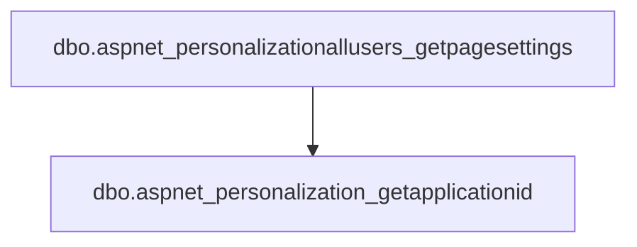

## Execution Tree — dbo.aspnet_personalizationallusers_getpagesettings

```mermaid
graph TD
    dbo_aspnet_personalization_getapplicationid[dbo.aspnet_personalization_getapplicationid]
    dbo_aspnet_personalizationallusers_getpagesettings[dbo.aspnet_personalizationallusers_getpagesettings] --> dbo_aspnet_personalization_getapplicationid[dbo.aspnet_personalization_getapplicationid]
```
