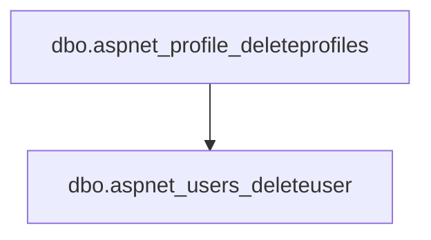

## Execution Tree — dbo.aspnet_profile_deleteprofiles

```mermaid
graph TD
    dbo_aspnet_users_deleteuser[dbo.aspnet_users_deleteuser]
    dbo_aspnet_profile_deleteprofiles[dbo.aspnet_profile_deleteprofiles] --> dbo_aspnet_users_deleteuser[dbo.aspnet_users_deleteuser]
```
