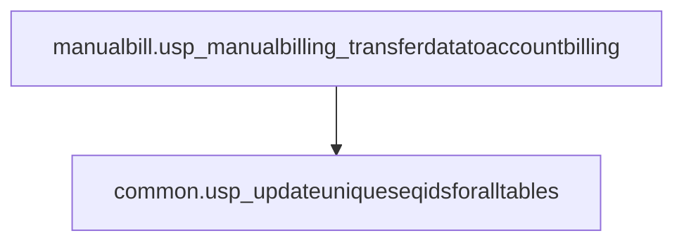

## Execution Tree — manualbill.usp_manualbilling_transferdatatoaccountbilling

```mermaid
graph TD
    common_usp_updateuniqueseqidsforalltables[common.usp_updateuniqueseqidsforalltables]
    manualbill_usp_manualbilling_transferdatatoaccountbilling[manualbill.usp_manualbilling_transferdatatoaccountbilling] --> common_usp_updateuniqueseqidsforalltables[common.usp_updateuniqueseqidsforalltables]
```
