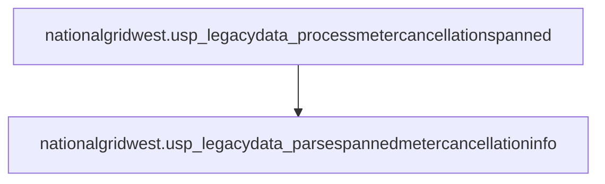

## Execution Tree — nationalgridwest.usp_legacydata_processmetercancellationspanned

```mermaid
graph TD
    nationalgridwest_usp_legacydata_parsespannedmetercancellationinfo[nationalgridwest.usp_legacydata_parsespannedmetercancellationinfo]
    nationalgridwest_usp_legacydata_processmetercancellationspanned[nationalgridwest.usp_legacydata_processmetercancellationspanned] --> nationalgridwest_usp_legacydata_parsespannedmetercancellationinfo[nationalgridwest.usp_legacydata_parsespannedmetercancellationinfo]
```
