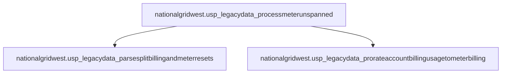

## Execution Tree — nationalgridwest.usp_legacydata_processmeterunspanned

```mermaid
graph TD
    nationalgridwest_usp_legacydata_parsesplitbillingandmeterresets[nationalgridwest.usp_legacydata_parsesplitbillingandmeterresets]
    nationalgridwest_usp_legacydata_prorateaccountbillingusagetometerbilling[nationalgridwest.usp_legacydata_prorateaccountbillingusagetometerbilling]
    nationalgridwest_usp_legacydata_processmeterunspanned[nationalgridwest.usp_legacydata_processmeterunspanned] --> nationalgridwest_usp_legacydata_parsesplitbillingandmeterresets[nationalgridwest.usp_legacydata_parsesplitbillingandmeterresets]
    nationalgridwest_usp_legacydata_processmeterunspanned[nationalgridwest.usp_legacydata_processmeterunspanned] --> nationalgridwest_usp_legacydata_prorateaccountbillingusagetometerbilling[nationalgridwest.usp_legacydata_prorateaccountbillingusagetometerbilling]
```
