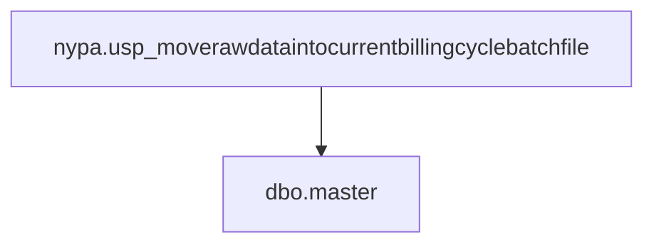

## Execution Tree — nypa.usp_moverawdataintocurrentbillingcyclebatchfile

```mermaid
graph TD
    dbo_master[dbo.master]
    nypa_usp_moverawdataintocurrentbillingcyclebatchfile[nypa.usp_moverawdataintocurrentbillingcyclebatchfile] --> dbo_master[dbo.master]
```
