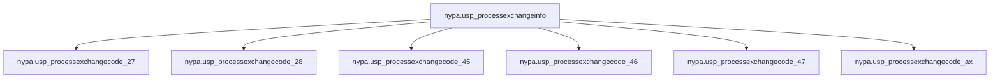

## Execution Tree — nypa.usp_processexchangeinfo

```mermaid
graph TD
    nypa_usp_processexchangecode_27[nypa.usp_processexchangecode_27]
    nypa_usp_processexchangecode_28[nypa.usp_processexchangecode_28]
    nypa_usp_processexchangecode_45[nypa.usp_processexchangecode_45]
    nypa_usp_processexchangecode_46[nypa.usp_processexchangecode_46]
    nypa_usp_processexchangecode_47[nypa.usp_processexchangecode_47]
    nypa_usp_processexchangecode_ax[nypa.usp_processexchangecode_ax]
    nypa_usp_processexchangeinfo[nypa.usp_processexchangeinfo] --> nypa_usp_processexchangecode_27[nypa.usp_processexchangecode_27]
    nypa_usp_processexchangeinfo[nypa.usp_processexchangeinfo] --> nypa_usp_processexchangecode_28[nypa.usp_processexchangecode_28]
    nypa_usp_processexchangeinfo[nypa.usp_processexchangeinfo] --> nypa_usp_processexchangecode_45[nypa.usp_processexchangecode_45]
    nypa_usp_processexchangeinfo[nypa.usp_processexchangeinfo] --> nypa_usp_processexchangecode_46[nypa.usp_processexchangecode_46]
    nypa_usp_processexchangeinfo[nypa.usp_processexchangeinfo] --> nypa_usp_processexchangecode_47[nypa.usp_processexchangecode_47]
    nypa_usp_processexchangeinfo[nypa.usp_processexchangeinfo] --> nypa_usp_processexchangecode_ax[nypa.usp_processexchangecode_ax]
```
