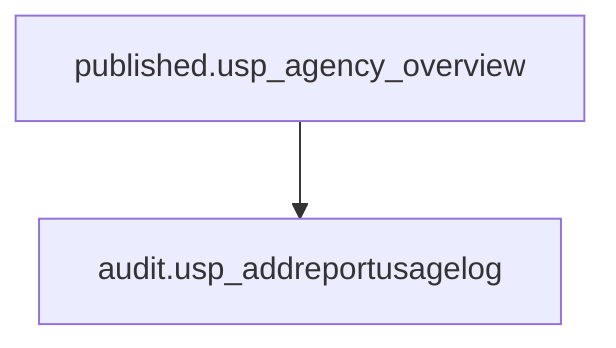

## Execution Tree — published.usp_agency_overview

```mermaid
graph TD
    audit_usp_addreportusagelog[audit.usp_addreportusagelog]
    published_usp_agency_overview[published.usp_agency_overview] --> audit_usp_addreportusagelog[audit.usp_addreportusagelog]
```
