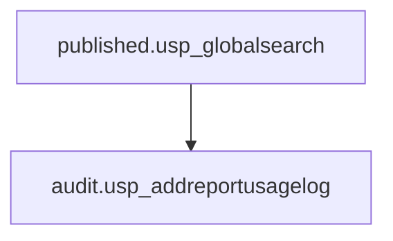

## Execution Tree — published.usp_globalsearch

```mermaid
graph TD
    audit_usp_addreportusagelog[audit.usp_addreportusagelog]
    published_usp_globalsearch[published.usp_globalsearch] --> audit_usp_addreportusagelog[audit.usp_addreportusagelog]
```
